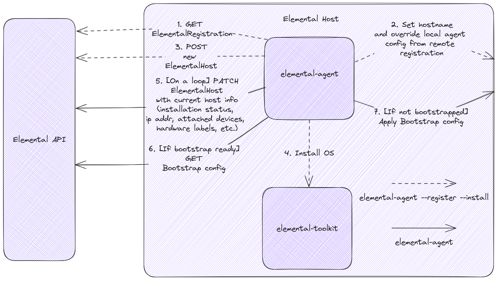

# Elemental CAPI Infrastructure Provider

This infrastructure provider brings the Elemental stack into the [Kubernete's Cluster API](cluster-api.sigs.k8s.io/).  

Elemental is a software stack enabling centralized, full cloud-native OS management with Kubernetes.  
For more information about the current features, please read the [official documentation](https://elemental.docs.rancher.com/).  

## State of the project

This project is an early prototype.  
It will eventually support all the features of the current [elemental-operator](https://github.com/rancher/elemental-operator).  
However, backward compatibility is not guaranteed at the moment.  

## Overview


## Quickstart

- [Quickstart documentation](doc/QUICKSTART.md)

## Local development

```bash
cat << EOF > $HOME/.cluster-api/clusterctl.yaml
providers:
  # add a custom provider
  - name: "elemental"
    url: "file:///${HOME}/cluster-api-provider-elemental/infrastructure-elemental/v0.0.0/infrastructure-components.yaml"
    type: "InfrastructureProvider"
EOF
```

## Managed Bare Metal hosts

Elemental consists of two main components that can be installed on any host machine:  

- [elemental-agent](cmd/agent/README.md) communicates with the Elemental API for OS inventory management and CAPI bootstrapping.  
- [elemental-toolkit](https://github.com/rancher/elemental-toolkit) builds, ship and maintain cloud-init driven Linux derivatives.  



## Elemental API

The Elemental API is a RESTful HTTP API than enables inventory management and CAPI bootstrapping capabilities.  
The specifications are published in [OpenAPI format](elemental-openapi.yaml).  
You can use it with any OpenAPI compliant tool, for example the online [Swagger Editor](https://editor.swagger.io/).  

This API is consumed by the `elemental-agent` and is meant for **Internal** use only.  

## Rancher Integration

[Rancher Turtles](https://docs.rancher-turtles.com/) is an extension to Rancher that brings increased integration with Cluster API.  

For more information on how to deploy an Elemental CAPI cluster and import it into Rancher, please read the related [documentation](doc/RANCHER.md).  
