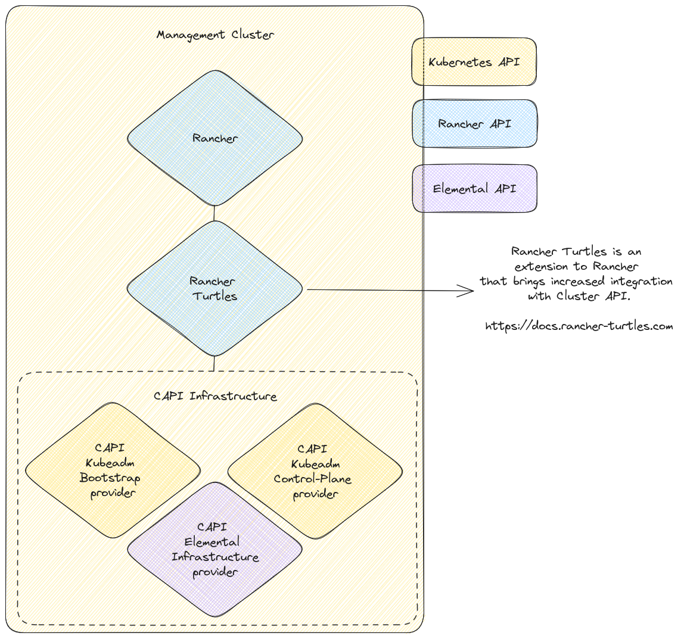

# Rancher Integration

## Overview

CAPI and Rancher integration is brought by the [Rancher Turtles](https://docs.rancher-turtles.com/) extension.  



## Preparation

- Create a CAPI Management cluster and a downstream k3s cluster following the [quickstart](./QUICKSTART.md) guide.

## Setup Rancher on the CAPI Management cluster

The following steps must be executed on the machine reserved to run the Rancher infrastructure.  

1. Install the following Helm repositories:

    ```bash
    helm repo add rancher-latest https://releases.rancher.com/server-charts/latest
    helm repo update
    ```

1. Install nginx-ingress controller:

    ```bash
    kubectl apply -f https://raw.githubusercontent.com/kubernetes/ingress-nginx/main/deploy/static/provider/kind/deploy.yaml
    ```

1. Install Rancher

    ```bash
    helm upgrade --install rancher rancher-latest/rancher \
    -n cattle-system \
    --set features=embedded-cluster-api=false \
    --set hostname=192.168.122.10.sslip.io \
    --set version=2.7.9 \
    --set namespace=cattle-system \
    --set bootstrapPassword=admin \
    --set replicas=1 \
    --create-namespace \
    --wait
    ```

1. Install Rancher Turtles

    Check the [official documentation](https://docs.rancher-turtles.com/docs/getting-started/install_turtles_operator) for more details.  

    ```bash
    helm repo add turtles https://rancher-sandbox.github.io/rancher-turtles/
    helm repo update
    
    helm upgrade --install rancher-turtles turtles/rancher-turtles --version v0.2.0 \
    -n rancher-turtles-system \
    --set cluster-api-operator.cert-manager.enabled=false \
    --set cluster-api-operator.cluster-api.enabled=false \
    --dependency-update \
    --create-namespace --wait \
    --timeout 180s 
    ```

1. Mark the namespace for auto-import:

    ```bash
    kubectl label namespace default cluster-api.cattle.io/rancher-auto-import=true
    ```

## CAPI workload cluster import

1. On the `control-plane` node, trust the Rancher self-signed CA.  
   Note that the command below will be different, to check which URL to use visit the Rancher's dashboard:  
   <https://192.168.122.10.sslip.io/dashboard/c/_/manager/provisioning.cattle.io.cluster>

    ```bash
    curl --insecure -sfL https://192.168.122.10.sslip.io/v3/import/vhfqz7phtgd92wv6hhtlg5fcc6jchg4png8bnjlpz87hbvrlg6rx66_c-m-4sp59cf5.yaml | KUBECONFIG=/etc/kubernetes/admin.conf kubectl apply -f -
    ```

## Check Results

If everything worked correctly, you should be able to see the imported cluster in the Rancher dashboard:  


